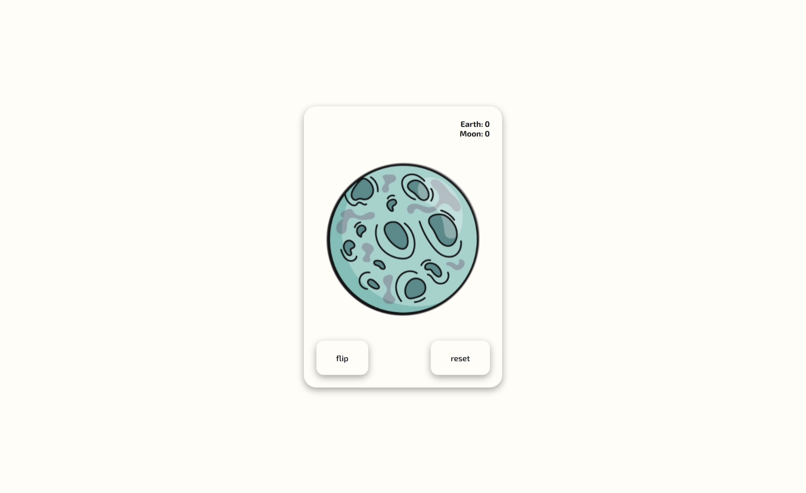

# Flip coin version: 1.0.0

This version includes some functionality:

- Flip a coin
- Show a score
- Reset a score

## Flip a coin

By pressing the "flip" button, the coin flip animation is played with a 50% chance of changing the side of the coin.

### Variables

Values of animation speed and drop chance can be changed in the file main.js.
The value of the number of turns of the coin can be changed in the style.css file.

## Show a score

There is a score on the card that shows the number of "Moon" and "Earth" that have fallen out.

## Reset a score

Pressing the "reset" button resets the account and also sets the starting side of the coin with the image of "Earth".

## Screenshot

